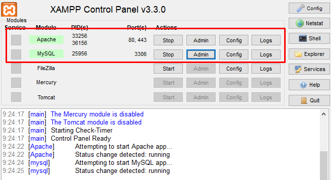
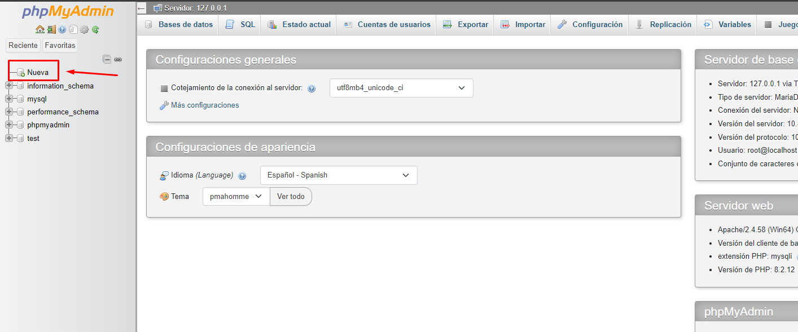
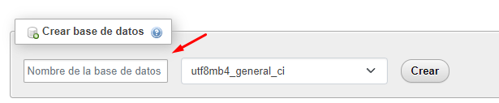

### Ruta de Investigación / Conceptos básicos:

## Parte 1

1.  **¿Qué es PHP y cuál es su función principal en el desarrollo web?**

    - PHP es un lenguaje de código abierto, orientado de lado del servidor, permitiendo cargar los elementos de una página antes de mostrarlos al usuario que accede a un sitio web. Es utilizado para crear aplicaciones web dinámicas.

2.  **¿Cuáles son las características clave de PHP que lo diferencian de otros lenguajes de programación?**

    - Integración con HTML
    - Compatibilidad con bases de datos
    - Comunidad activa de desarrolladores

3.  **¿Cuál es la sintaxis básica de PHP y cuáles son las convenciones de nomenclatura utilizadas?**

    - Su sintaxis básica comienza con unas etiquetas de inicio y final de script:

    ```php
    <?php

    ?>
    ```

    - Podemos usar `echo` para imprimir contenido en la pantalla del navegador:

    ```php
    <?php
        echo "Hola, mundo!"
    ?>
    ```

    - Comentarios:

    ```php
    <?php
     // Esto es un comentario de una sola línea
     /* Esto es un comentario multilínea*/
    ?>
    ```

4.  **¿Cuáles son los tipos de datos admitidos en PHP y cómo se manejan?**

    - PHP admite tipos de datos como enteros, decimales, cadenas, booleanos, arrays, etc..

    - **Ejemplos**:

    ```php
     // String y cadena de Strings
     $nombre = "Desiree";
     $mensaje = "Que tal estas";

     // Enteros (int)
     $numeroEntero = 5;

     // Floats / Double (Decimales)
     $numeroFloat = 12.5;

     // Booleanos
     $esBoolean = true;

     // Arrays
     $colores = array("rojo", "verde", "azul");
    ```

5.  **¿Cuál es la diferencia entre una variable local y una variable global en PHP?**

    - Las variables locales se definen dentro de una función y tienen un alcance limitado a esa función. Las variables globales se declaran fuera de las funciones y pueden accederse desde cualquier parte del código.

6.  **¿Qué son los arrays en PHP y cómo se utilizan para almacenar y manipular datos?**

    - Los arrays en PHP permiten almacenar conjuntos de datos. Pueden ser indexados o asociativos.

      - **Los arrays indexados, utilizan indices númericos para poder acceder a sus elementos. El indice comienza desde 0 y se va incrementando.**

        - **Ejemplo de Array indexado:**

        ```php
        $cars = ["Volvo", "BMW", "Toyota"];

        echo $cars[0]; // Salida: Volvo
        echo $cars[1]; // Salida: BMW
        echo $cars[2]; // Salida: Toyota
        ```

      - **Los Arrays asociativos, utilizan pares de clave-valor para asociar sus valores a elementos específicos**

        - **Ejemplo de Array Asociativo:**

        ```php
        $persona = array[
            "nombre" => "Juan";
            "edad" => 50;
            "casado" => false;

        ];

        echo $persona["edad"]; // Salida: 50
        ```

    - A la hora de manipular datos, tenemos varias funciones:

      - `count()` Devuelve la cantidad de elementos de un array:

      ```php
      $cantidad = count($cars);
      ```

      - `array_push()` Agrega uno o más elementos al final de un array:

      ```php
      array_push($cars, "mercedes", "mini");
      ```

      - `array_pop()` Elimina el último elemento del array:

      ```php
      $lastCar = array_pop($cars)
      ```

7.  **¿Cómo declarar variables en PHP?**

    - A la hora de declarar variables en PHP, se utiliza el signo del dolar "$" seguido del nombre de la variable. Ya que es un lenguaje débilmente tipado, no es necesario declarar el tipo de la variable.

      **Ejemplo:**

      ```php
      $nombre_variable = valor;
      ```

8.  **¿Cómo declarar funciones en PHP?**

    - Las funciones se declaran de la siguiente manera:

      ```php
      function saludar($nombre){
          return "Hola! $nombre!"
      }
      echo saludar("Pepe"); // Salida: Hola! Pepe!
      ```

9.  **¿Cómo conectar PHP con HTML y mostrar un “Hola Mundo” en el browser a través del servidor de PHPmyAdmin?**

    - Podemos usar este ejemplo de estructura:

      ```php
      <?php
      $mensaje = "Hola Mundo";
      ?>

      <!DOCTYPE html>
      <html lang="es">
      <head>
          <meta charset="UTF-8">
          <title>Saludo PHP</title>
      </head>
      <body>
          <h1><?php echo $mensaje; ?></h1>
      </body>
      </html>
      ```

10. **¿Cómo uso la consola con PHP?**

    - Pueden ejecutarse scripts de PHP desde consola utilizando el comando `php`

      **Ejemplo:**

      ```hash
      php mi_script.php
      ```

11. **¿Cómo reutilizar funciones desde otros documentos de PHP?**

    - Para reutilizar funciones desde otros documentos PHP, se pueden incluir esos documentos usando include o require. Ejemplo:

      ```php
      // Archivo de funciones.php
      function sumar($a,$b){
          return $a + $b
      }
      ```

      ```php
      // En otro archivo
      include "archivo_funciones.php"
      echo sumar(3,5); // Salida: 8
      ```

12. **¿Qué son los modificadores de acceso?**

    - Los modificadores de acceso son palabras clave que se utilizan para controlar el acceso a las propiedades y métodos de una clase. Entre ellos tenemos public, private y protected.

13. **¿Qué es public?**

    - Es un modificador de acceso en el nivel mas permisivo. Es accesible desde cualquier lugar, dentro o fuera de la clase. Por ejemplo:

    ```php
        class Animal {
        public $nombre;
        }

        $miMascota = new Animal();
        $miMascota->nombre = "Pistacho"; // Acceso directo a la propiedad pública. Podemos cambiar su valor directamente haciendo uso de la propiedad.
    ```

14. **¿Qué es private?**

    - Es un modificador de acceso en el nivel más restrictivo. Sirve para indicar que esa variable solo se va a poder acceder desde el propio objeto, nunca desde fuera. Solo se puede acceder y modificar dentro de la propia clase. Por ejemplo:

    ```php
        class Animal {
        private $nombre;

        public function asignarNombre($nuevoNombre) {
            $this->nombre = $nuevoNombre;  //Cambiamos el valor al atributo privado
        }

        public function obtenerNombre() {
            return $this->nombre;  //Obtenemos el valor del atributo privado
        }
    }
    $miMascota = new Animal();
    $miMascota->asignarNombre("Pipo");  //Se interactua con la propiedad mediante un método público asignarNombre()
    $nombre = $miMascota->obtenerNombre();  //Se interactua con la propiedad mediante un método público obtenerNombre()
    ```

15. **¿Qué es protected?**

    - Es un modificador de acceso a nivel medio. Sirve para que el metodo o atributo sea público dentro del código de la propia clase y de cualquier clase que herede de aquella donde esté el metodo o la propiedad protected. Es privado y no accesible desde cualquier otra parte. Por ejemplo:

    ```php
        class Animal {
        private $nombre;

        public function asignarNombre($nuevoNombre) {
            $this->nombre = $nuevoNombre;  //Cambiamos el valor al atributo privado
        }

        public function obtenerNombre() {
            return $this->nombre;  //Obtenemos el valor del atributo privado
        }
    }
    $miMascota = new Animal();
    $miMascota->asignarNombre("Toby");  //Se interactua con la propiedad mediante un método público asignarNombre()
    $nombre = $miMascota->obtenerNombre();  //Se interactua con la propiedad mediante un método público obtenerNombre()
    ```

    **La diferencia con `protected` en lugar de `private` es que `$nombre` será accesible desde sus clases derivadas, o sea clases heredadas (hijas). Eso quiere decir que las clases hijas pueden acceder a esta propiedad protegida.**

## Parte 2

1. **¿Cómo creo una base de datos en PHPMyAdmin? Crea una BBDD**

   1. En caso de haber utilizado XAMPP, hay que asegurarse de que los módulos Apache y MySQL estén activos.

      

   2. Accede a phpMyAdmin:

      Abre tu navegador web e introduce la URL de phpMyAdmin. Por lo general, será http://localhost/phpmyadmin/.

   3. Selecciona el servidor (si es necesario):

      En la página principal de phpMyAdmin, selecciona el servidor de la lista en el lado izquierdo. En entornos locales con XAMPP, a menudo solo hay un servidor disponible, y se selecciona automáticamente.

   4. Crear nueva base de datos:

      Haz clic en la pestaña "Nueva" en la parte superior de la interfaz de phpMyAdmin.

      

   5. Introduce el nombre de la base de datos:

      En la sección "Crear base de datos", ingresa un nombre para tu nueva base de datos.

      

   6. Selecciona la codificación y el cotejamiento (opcional):

      Puedes seleccionar la codificación y el cotejamiento según tus preferencias o dejar los valores predeterminados.

   7. Haz clic en "Crear":

      Después de ingresar el nombre y configurar las opciones deseadas, haz clic en el botón "Crear" para crear la base de datos.

2. ¿Cómo consulto información a esa base datos? haz 3 queries dentro de MySQL

   1. Pongamos de ejemplo que tienes una tabla que se llama `usuarios`. La consulta para seleccionar todos los registros de esa tabla seria :

      ```sql
      SELECT * FROM usuarios;
      ```

      Esta consulta recuperará todas las columnas de todos los registros de la tabla usuarios.

   2. Podemos seleccionar registros especificos basados en una condicion. Imagina que deseas obtener todos los usuarios cuyo nombre sea "Pedro". En este caso, la consulta seria asi:

      ```sql
      SELECT * FROM usuarios WHERE nombre = "Juan";
      ```

      Esta consulta devolverá todos los registros de tabla usuarios donde el campo `nombre` es igual a "Juan".

   3. Podemos también ordenar resultados de una consulta. Si quieres obtener resultados de una consulta en funcion de una columna, puedes usar `ORDER BY`.

      - Por ejemplo, si deseas ordenar los usuarios por edad de forma ascendente usando `ASC`, la consulta sería así:

      ```sql
      SELECT * FROM usuarios ORDER BY edad ASC;
      ```

3. ¿Qué significa CRUD?

   - CRUD es un acrónimo que se refiere a las cuatro operaciones básicas que en este caso, se pueden realizar en la gestión de datos en sistemas de bases de datos (Create, Read, Update, Delete). Cada letra en CRUD representa una operación específica:

     - Crear (Create):

     Corresponde a la acción de crear nuevos registros o entradas en una base de datos. En
     SQL, esto se realiza mediante la instrucción `INSERT`.

     - Leer (Read):

     Corresponde a la acción de leer o recuperar información de la base de datos. En SQL, esto se logra con la instrucción `SELECT`. La operación de lectura es a menudo asociada con la consulta de datos existentes.

     - Actualizar (Update):

     Corresponde a la modificación de registros existentes en la base de datos. En SQL, esto se realiza con la instrucción `UPDATE`. La operación de actualización implica cambiar los valores de ciertos campos en registros ya existentes.

     - Eliminar (Delete):

     Corresponde a la eliminación de registros de la base de datos. En SQL, esto se logra con la instrucción `DELETE`. La operación de eliminación implica eliminar registros específicos de la base de datos.

4. ¿Cómo conecto código PHP a mi base de datos? Haz el servicio de conexión

   - Ejemplo de servicio de conexión:

   ```php
   //Datos de conexion a la base de datos
   $host = "nombre_del_host"; // por lo general, seria "localhost" si estas trabajando de forma local
   $usuario = "tu_usuario";
   $contrasenia = "tu_contraseña";
   $base_de_datos = "nombre_de_tu_base_de_datos";

   //Creamos la conexion
   $conexion = new mysql($host, $usuario, $contrasenia, $base_de_datos)

   //Verificamos la conexion
   if($conexion->connect_error){
       die("Error en la base de datos" . $conexion->connect_error);
   }

   //Llegados a este punto, significa que la conexion fue exitosa
   echo "La conexion a la base de datos se realizo correctamente"

   //Introduciriamos aqui la lógica

   //Cerramos la conexion a la BBDD cuando se haya terminado
   $conexion->close();
   ```

   - En este ejemplo:

     - Se utiliza la clase mysqli para establecer la conexión con la base de datos.
     - Se verifican posibles errores de conexión.
     - Si la conexión es exitosa, puedes realizar operaciones con la base de datos dentro del bloque correspondiente.
     - Finalmente, se cierra la conexión cuando hayas terminado de trabajar con la base de datos.
     - Dato a destacar: En la actualidad, se recomienda el uso de la extensión mysqli o PDO en lugar de la extensión mysql, ya que mysql está obsoleta. También se aconseja utilizar consultas preparadas para prevenir ataques de inyección SQL.

## Parte 3

1.  ¿Cómo se manejan las excepciones en PHP y cuál es la estructura básica de un bloque
    try-catch?

    - En PHP, se pueden manejar esas excepciones utilizando bloques try, catch. Estos bloques nos permiten manejar estas excepciones de una manera controlada. En lugar de permitir que una excepción cause que nuestro programa se detenga abruptamente, podemos "atrapar" la excepción y manejarla de una manera específica.

    La estructura básica de un bloque try-catch en PHP es la siguiente:

    ```php
    try {
    //Código que podría causar una excepción
    } catch (TipoDeExcepcion $excepcion) {
    //Código que se ejecuta si ocurre la excepción
    }
    ```

    **Código de ejemplo:**

    ```php
    try {
    $resultado = 10 / 0;  //Esto provocará una excepción de división por cero
    echo "Este código no se ejecutará debido a la excepción.";
    } catch (DivisionByZeroError $excepcion) {
    //Aquí manejamos la excepción
    echo "Error: " . $excepcion->getMessage();
    }
    ```

    **En este ejemplo:**

    1. **Bloque `try` - Intento:**

    - En el bloque try, escribimos el código que podría causar una excepción. En este caso, estamos intentando dividir el número 10 por 0 ($resultado = 10 / 0).

    2. **Excepción de División por Cero:**

    - La división por cero es una operación indefinida en matemáticas y provocará una excepción llamada DivisionByZeroError.

    3. **Bloque `catch` - Captura:**

    - En el bloque `catch`, especificamos qué tipo de excepción estamos esperando manejar (DivisionByZeroError). Si ocurre la excepción, el código dentro del bloque `catch` se ejecutará.
    - La variable $excepcion contendrá información sobre la excepción, como su mensaje.

    4. **Manejo de la Excepción:**

    - Dentro del bloque `catch`, escribimos el código que queremos ejecutar cuando se lance la excepción. En este caso, imprimimos un mensaje de error que incluye el mensaje de la excepción.

2.  ¿Qué es MySQL y cómo se integra con PHP para la manipulación de bases de datos?

    - MySQL es un sistema de gestión de bases de datos relacional, que se utiliza para almacenar y gestionar datos de manera estructurada.
    - Su integración con PHP:

    1. Nos conectamos a la BBDD
       ```php
       $host = "nombre_del_host"; // por lo general, seria "localhost" si estas trabajando de forma local
       $usuario = "tu_usuario";
       $contrasenia = "tu_contraseña";
       $base_de_datos = "nombre_de_tu_base_de_datos";
       ```
    2. Creamos la conexion a la BBDD, utilizando `mysqli_connect`

       ```php
       $conexion = mysqli_connect($host, $usuario, $contrasenia, $base_de_datos);
       ```

    3. Verificamos la conexion

       ```php
       if ($conexion->connect_error) {
       die("Error de conexión: " . $conexion->connect_error);
       }
       ```

    4. Ejemplo de consulta con `mysqli_query`

       ```php
       $sql = "SELECT nombre, edad FROM usuarios";
       $resultado = $conexion->mysqli_query($sql);
       ```

3.  ¿Cuáles son las técnicas comunes utilizadas para el manejo de formularios en PHP y cómo se
    valida la entrada de datos?

    - A continuacion, se muestran ejemplos de tecnicas más comunes para el manejo de formularios en PHP y validar la entrada de datos:

    ## Manejo de Formularios en PHP

    - **Creación de Formularios HTML**

        - Se utiliza la etiqueta `<form>` en HTML para envolver los elementos de formulario.
        - Se usan las etiquetas `<input>`, `<select>`, `<textarea>`, etc., para crear campos de entrada.
        - Se especifica el archivo de script PHP en el atributo "action" del formulario.
        - Se utiliza el método "post" o "get" para enviar los datos al servidor.

        ```html
        <form action="procesar_formulario.php" method="post">
            <!-- Elementos del formulario -->
            <input type="text" name="nombre" />
            <input type="submit" value="Enviar" />
        </form>

    - **Procesamiento del Formulario en PHP**

        - $_SERVER["REQUEST_METHOD"] == "POST" verifica si el formulario se envió utilizando el método POST.
        -  $_POST["nombre"] recupera el valor del campo de formulario llamado "nombre" que fue enviado desde el formulario.
        - La variable $nombre ahora contiene el valor ingresado por el usuario en el campo de nombre.

        ```php
        // procesar_formulario.php
        if ($_SERVER["REQUEST_METHOD"] == "POST") {
        $nombre = $_POST["nombre"];
        // Aqui se procesan los datos del formulario
        }
        ```
        
    ## Validación de Entrada de Datos en PHP

    - **Filtrar y Limpiar Datos:**

        - Se usan funciones como `filter_input()` o `filter_var()` para filtrar y limpiar datos de entrada.
        - `FILTER_SANITIZE_STRING` elimina tags HTML y caracteres especiales de una cadena.

        ```php
        $nombre = filter_input(INPUT_POST, 'nombre', FILTER_SANITIZE_STRING);
        ```
    - **Validación con Expresiones Regulares**

        - Las expresiones regulares son patrones que permiten verificar el formato de una cadena.
        - preg_match() se utiliza para comprobar si una cadena coincide con un patrón.

        ```php
        if (preg_match("/^[a-zA-Z ]*$/", $nombre)) {
        // Validación exitosa
        } else {
        // Error en la validación
        }
        ```
    - **Manejo de errores**

        - Se pueden usar variables para almacenar mensajes de error y mostrarlos al usuario.

        ```php
        $errores = array();

        if (empty($nombre)) {
            $errores[] = "El nombre es obligatorio.";
        }

        if (count($errores) > 0) {
            foreach ($errores as $error) {
                echo $error . "<br>";
            }
        } else {
            // Procesa los datos si no hay errores
        }
        ```
    - **Funciones de Validación de PHP**

        - PHP tiene funciones integradas como `empty()`, `strlen()`, `is_numeric()`, etc., que permiten verificar condiciones específicas.

        ```php
        if (empty($nombre)) {
        // Maneja el error
        }

        if (strlen($password) < 6) {
            // Contraseña demasiado corta
        }
        ```