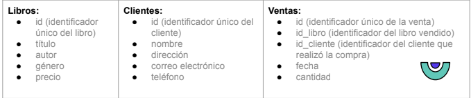
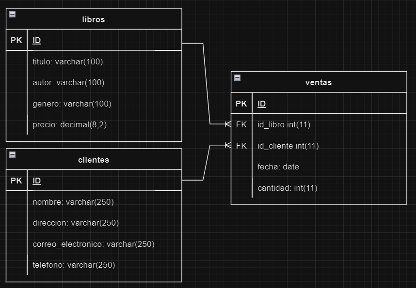

# Primeros pasos SQL

Imagina que estás trabajando en una tienda de libros y necesitas gestionar la información relacionada
con los libros, los clientes y las ventas. En este caso de uso, utilizaremos una base de datos para
almacenar los datos necesarios y realizar consultas y manipulaciones a través de SQL.

### Debes estructurar la base de datos con las entidades mencionadas anteriormente, con los siguientes datos:



## PARTE 1:

- Mostrar todos los libros disponibles en la tienda.

  ```sql
  SELECT * FROM `libros`
  ```

- Mostrar todos los clientes registrados en la base de datos.

    ```sql
    SELECT * FROM `clientes`
    ```
- Mostrar todas las ventas realizadas hasta el momento.

    ```sql
    SELECT * FROM ventas;
    ```

## PARTE 2:
- Obtener el precio promedio de los libros de un género específico.

  ```sql
  SELECT genero, AVG(precio) AS precio_promedio
  FROM libros
  WHERE genero = 'Misterio'
  GROUP BY genero;
  ```
- Mostrar los libros vendidos en un rango de fechas determinado.

  ```sql
  SELECT *
  FROM ventas
  WHERE fecha BETWEEN '2020-01-01' AND '2024-01-31';
  ```
- Obtener el cliente que más compras ha realizado


## PARTE 3:
- Insertar un nuevo libro en la base de datos.

  ```sql
  INSERT INTO libros (titulo, autor, genero, precio) 
  VALUES ("Asesinato en el Orient Express", "Agatha Christie", "Misterio", 27.50)
  ```
- Actualizar el precio de un libro existente.

  ```sql
  UPDATE libros
  SET precio = 24.99
  WHERE id = 1;
  ```
- Registrar una nueva venta en la base de datos.

  ```sql
  INSERT INTO ventas (id_libro, id_cliente, fecha, cantidad) 
  VALUES (6, 9, "2023-05-25", 2)
  ```

## PARTE 4
- Haz el modelo relacional de las entidades




## PARTE 5 Desafío Extra:
- Mostrar los libros más vendidos en orden descendente.

```sql
  SELECT libros.id, libros.titulo, COUNT(ventas.id) AS total_ventas
  FROM libros
  LEFT JOIN ventas ON libros.id = ventas.id_libro
  GROUP BY libros.id, libros.titulo
  ORDER BY total_ventas DESC;
  ```

- Calcular el total de ventas y el promedio de ventas diarias.

```sql
SELECT
  SUM(cantidad) AS total_ventas,
  AVG(cantidad) AS promedio_ventas_diarias
FROM ventas;
```

---
*Ejercicios del Taller Primeros Pasos de F5-Femcoders 💜*