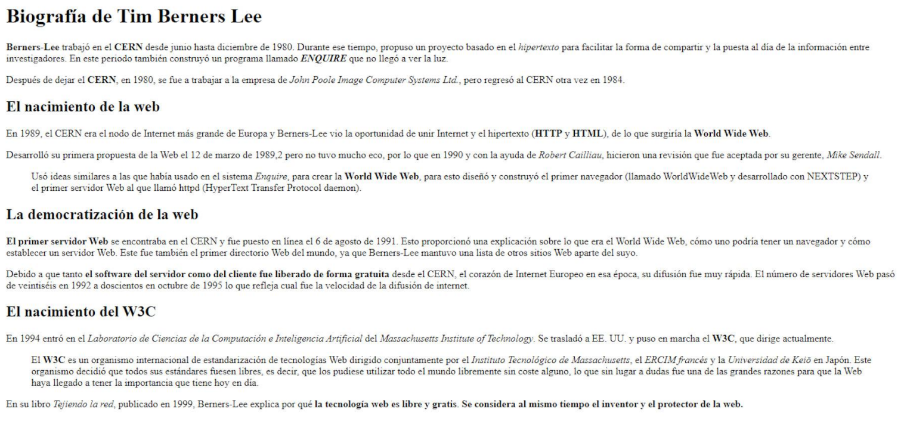

# Ejercicios 2 HTML Baby steps

## Parte 1
Se facilita un documento que hay que clonar.

Gracias a la MC de HTML y CSS.
Ahora empezamos por las etiquetas usadas en el ejercicio y para que valen.

### Estructura Básica de HTML y Elementos Semánticos
La estructura básica que he usado en página web HTML incluye las siguientes partes:

- `<!DOCTYPE html>`: Declaración que define el tipo de documento HTML.
- `<html>`: Elemento raíz que engloba todo el contenido de la página.
- `<head>`: Contiene metadatos y enlaces a recursos externos.
  - `<meta>`: Define metainformación como el conjunto de caracteres y la escala de la vista.
  - `<title>`: Define el título de la página que aparecerá en la pestaña del navegador.
- `<body>`: Contiene el contenido visible de la página.
  - `<main>`: Define el contenido principal de la página.
  - `<section>`: Define una sección temática de contenido.
  - `<h1>`, `<h2>`, etc.: Encabezados que indican la jerarquía del contenido.
  - `
`: Párrafos de texto.
  - `<strong>`: Texto en negrita para enfatizar.
  - `<cite>`: Citas o referencias.
  - `<blockquote>`: Citas o bloques de texto destacados.

## Parte 2
En el mismo documento, 

- `<table>`: Crea una tabla para organizar datos tabulares.
  - `<tr>`: Define una fila en la tabla.
  - `<td>`: Define una celda de datos en la fila.
  - `<ol>`: Crea una lista ordenada.
    - `<li>` :  Elemento de lista dentro de una lista no ordenada o lista ordenada.
  - `<ul>`: Crea una lista no ordenada.
    - `<li>` :  Elemento de lista dentro de una lista no ordenada o lista ordenada.

#### Atributos de Listas Ordenadas
Dentro de la tabla, he utilizado la etiqueta `<ol>` con atributos personalizados:
- `type="a" start="4"`: Define una lista ordenada con letras minúsculas comenzando desde "d".
- `type="1" start="100" reversed`: Crea una lista ordenada con números comenzando desde 100 en orden descendente.
- `type="i" start="1099"`: Genera una lista ordenada con números romanos en orden descendente comenzando desde 1099.
- `style="list-style-type: circle;"`: Esto define viñetas circulares para los elementos de la lista no ordenada.
- `style="list-style-type: square;"`: Esto establece viñetas cuadradas para los elementos de la lista no ordenada.

---
---
