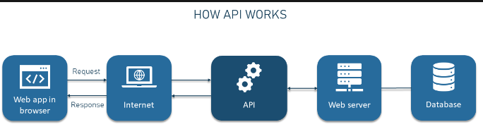

# ¿Qué es una API?

Una API (Interfaz de Programación de Aplicaciones) es un conjunto de reglas y herramientas que permite a diferentes aplicaciones de software comunicarse entre sí. Permite que la aplicación acceda a los datos o funcionalidades de otra aplicación, servicio o plataforma de manera segura y estructurada.

## Contexto
Una API, es como un mesero en un restaurante. Imagina que estás en un restaurante y quieres pedir comida. No puedes ir directamente a la cocina y preparar la comida tú mismo, así que le das tu pedido al mesero. El mesero lleva tu pedido a la cocina, donde se prepara la comida, y luego te trae lo que has pedido.

**En este ejemplo:**

1. El mesero es la API. Toma tu solicitud y la entrega al lugar correcto para obtener lo que necesitas.
2. La cocina es el servidor o el sistema que proporciona el servicio o la información que solicitaste.
3. Entonces, una API proporciona una forma estandarizada para que diferentes aplicaciones se comuniquen entre sí. Puedes enviar una solicitud a una API con ciertos parámetros (como enviar un pedido al mesero) y la API te devolverá una respuesta (como traerte la comida).

En resumen, una API te permite acceder y utilizar funcionalidades o datos de otras aplicaciones o servicios de manera segura y controlada.




## Consumo de APIs en JavaScript

JavaScript es un lenguaje de programación muy utilizado en el desarrollo web, y consumir APIs es una parte común de muchas aplicaciones web modernas. Hay varias formas de consumir APIs en JavaScript, incluyendo el uso `fetch` o `axios` para realizar solicitudes HTTP.

# Consumo de APIs con Fetch y Axios

## Fetch

Fetch es una API moderna de JavaScript que proporciona una interfaz para realizar solicitudes HTTP asincrónicas.

Es compatible con la mayoría de los navegadores modernos y es fácil de usar para realizar solicitudes ``GET``, ``POST``, ``PUT``, ``DELETE``, entre otras.

#### Ejemplo:

```javascript
async function enviarDatos() {
  const data = {
    // Datos que deseas enviar en la solicitud POST
    nombre: "Ejemplo",
    edad: 30,
  };

  try {
    // Realiza solicitud POST a la API
    const response = await fetch("https://api.example.com/data", {
      method: "POST",
      headers: {
        "Content-Type": "application/json",
      },
      body: JSON.stringify(data),
    });

    // Verifica si la solicitud fue exitosa
    if (response.status === 201) {
      // Código 201: Created (creado)
      console.log("Datos enviados correctamente");
    } else {
      throw new Error("La solicitud no se completó correctamente");
    }
  } catch (error) {
    console.error("Error al enviar datos:", error);
    throw error;
  }
}

enviarDatos();
```

## Axios

Axios es una biblioteca HTTP basada en promesas para el navegador y Node.js. Proporciona una forma más fácil de realizar solicitudes HTTP y manejar respuestas que Fetch.

Axios simplifica la escritura de código y maneja automáticamente la serialización y deserialización de datos.

#### Ejemplo:

```javascript
import axios from "axios";

async function enviarDatos() {
  const data = {
    // Datos que deseas enviar en la solicitud POST
    nombre: "Ejemplo",
    edad: 30,
  };

  try {
    // Realiza solicitud POST a la API
    const response = await axios.post("https://api.example.com/data", data);

    // Verifica si la solicitud fue exitosa
    if (response.status === 201) {
      // Código 201: Created (creado)
      console.log("Datos enviados correctamente");
    } else {
      throw new Error("La solicitud no se completó correctamente");
    }
  } catch (error) {
    console.error("Error al enviar datos:", error);
    throw error;
  }
}

enviarDatos();
```

## ⚡ Diferencias y Consideraciones

- **Fetch** es una API nativa de JavaScript y no requiere la instalación de bibliotecas adicionales, lo que la hace ideal para proyectos que buscan mantener un tamaño pequeño y evitar dependencias externas.

- **Axios**, por otro lado, es una biblioteca externa que ofrece una sintaxis más limpia y funciones adicionales, como la cancelación de solicitudes y la protección contra ataques CSRF (Cross-Site Request Forgery).

- **Compatibilidad**: **Fetch** es compatible con la mayoría de los navegadores modernos, mientras que **Axios** proporciona una compatibilidad más amplia, incluidos los navegadores antiguos y Node.js.

- **Flexibilidad**: **Axios** ofrece más funcionalidades y personalización, como la posibilidad de enviar y recibir cookies con facilidad y definir interceptores de solicitudes y respuestas, lo que lo hace más flexible en comparación con Fetch.


---
---

[🏠 Volver al Home](../README.md)