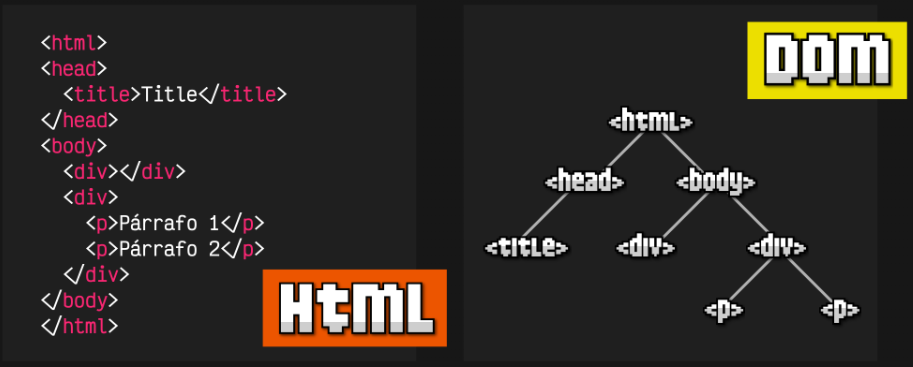

# HTML y el Modelo de Objetos del Documento (DOM)

El DOM (Document Object Model) es una interfaz de programación que representa documentos HTML y XML como estructuras de árbol, donde cada nodo del árbol representa parte del documento. 

Cada elemento del documento es un nodo en el árbol DOM. Esto permite a los programas acceder y manipular dinámicamente el contenido, estructura y estilo de un documento.

En el contexto de la web, el DOM es especialmente útil cuando trabajas con HTML. 

Cuando un navegador carga una página web, crea una representación del documento en memoria utilizando el DOM. 

Este modelo permite a los desarrolladores web interactuar con la página de manera dinámica, actualizando o modificando el contenido en respuesta a eventos o acciones del usuario en tiempo real.


*Imágen sacada de https://lenguajejs.com/javascript/dom/que-es/*


## Aqui se muestran ejemplos de como utilizamos el DOM:

### Primer ejemplo: 

```js
<!DOCTYPE html>
<html>
<head>
  <title>createElement y appendChild Ejemplo</title>
</head>
<body>
  <h1>Mi Lista de Tareas</h1>

  <ul id="lista-tareas">
    <!-- Aquí se agregarán las tareas -->
  </ul>

  <script>
    // Crea un nuevo elemento li
    let nuevaTarea = document.createElement('li');

    // Agrega texto al elemento li
    nuevaTarea.textContent = 'Hacer la compra';

    // Obtiene la referencia al elemento ul
    let listaTareas = document.getElementById('lista-tareas');

    // Agrega el nuevo elemento li a la lista
    listaTareas.appendChild(nuevaTarea);

    // Crea otra tarea
    let otraTarea = document.createElement('li');
    otraTarea.textContent = 'Estudiar para el examen';

    // Agrega la nueva tarea a la lista
    listaTareas.appendChild(otraTarea);
  </script>
</body>
</html>
```

**En este ejemplo:**

- Creamos un nuevo elemento `<li>` usando createElement.
- Asignamos texto a ese elemento usando la propiedad textContent.
- Obtenemos una referencia al elemento `<ul>` con el id "lista-tareas".
- Usamos appendChild para agregar el nuevo elemento `<li>` a la lista.


### Segundo ejemplo: 

```js
<!DOCTYPE html>
<html>
<head>
  <title>Acceso al DOM</title>
</head>
<body>
  <h1 id="titulo">Mi Página Web</h1>
  <p class="parrafo">Este es un párrafo de ejemplo.</p>

  <script>
    // Accediendo al DOM con JavaScript
    let titulo = document.getElementById('titulo');
    titulo.innerHTML = 'Nuevo Título';

    let parrafos = document.getElementsByClassName('parrafo');
    parrafos[0].style.color = 'blue';
  </script>
</body>
</html>
```

**En este ejemplo:**  
- Usamos JavaScript para acceder al DOM. 
- Cambiamos el contenido del elemento con el id "titulo" y cambiamos el color del primer elemento con la clase "parrafo".

El DOM facilita la manipulación y actualización de la página web en tiempo real, permitiendo a los desarrolladores crear experiencias interactivas para los usuarios.